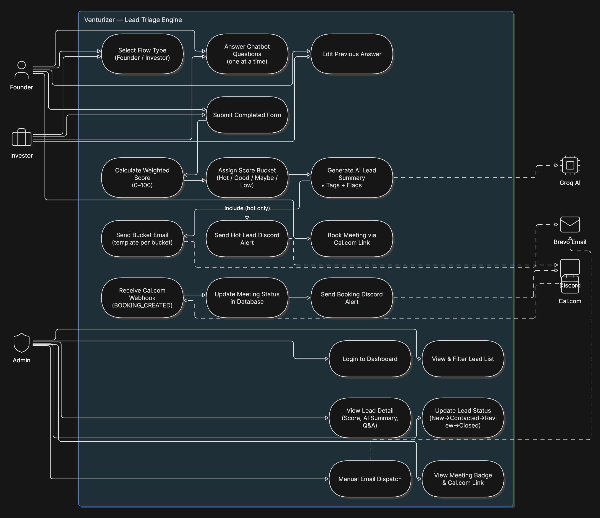

# Venturizer — AI-Powered Lead Triage Engine

> **Internship Assignment | Full-Stack Development Track**
> Converts 500+ monthly inbound enquiries from founders and investors into a scored, triaged, automated pipeline — so the team only spends time on judgment calls, not data entry.

---

## Table of Contents

- [Overview](#overview)
- [Application Flow Diagram](#application-flow-diagram)
- [Demo Video](#demo-video)
- [Tech Stack](#tech-stack)
- [Database Schema](#database-schema)
- [API Documentation](#api-documentation)
- [Local Setup](#local-setup)
- [Environment Variables Reference](#environment-variables-reference)
- [Project Structure](#project-structure)
- [Scoring Engine](#scoring-engine)
- [Automations](#automations)

---

## Overview

Venturizer receives inbound enquiries from startup founders and institutional investors. Before this system, every enquiry was read manually — a process that does not scale and delays response to high-quality leads.

This project replaces manual triage with:

- **A conversational chatbot** that collects 16–20 structured answers (one question at a time), validates every answer both client-side and server-side, and submits to the backend on completion.
- **A weighted scoring engine** that maps every submission to a 0–100 score and one of four action buckets (Hot / Good / Maybe / Low).
- **An AI analysis layer** (Groq LLaMA) that generates a 3–4 sentence lead summary, extracts sector tags, and flags inconsistencies.
- **Automated communications** — bucket-specific emails via Brevo and real-time Discord alerts for Hot leads.
- **Cal.com scheduling integration** — Hot-bucket emails include a booking link. When a meeting is created, a Cal.com webhook updates the lead record and posts a Discord alert.
- **An admin ERP dashboard** — filterable lead list, full Q&A detail view, score breakdown, AI summary, status workflow, communication history, and meeting tracking.

---

## Application Flow Diagram

> Paste your Easel.io diagram below once exported.



---

## Demo Video

> Add your Loom / YouTube video link here.

[](YOUR_VIDEO_LINK_HERE)

---

## Tech Stack

| Layer | Technology | Purpose |
|---|---|---|
| **Frontend** | React 18 + Vite + TypeScript | Chatbot UI and admin dashboard |
| **Backend** | Node.js + Express + TypeScript | REST API, scoring, AI orchestration |
| **Database** | PostgreSQL on Neon (serverless) | Lead, response, and question storage |
| **AI / LLM** | Groq (LLaMA 3.3 70B) | Lead summary, tagging, flagging |
| **Email** | Brevo (Sendinblue) Transactional API | Bucket-specific automated emails |
| **Alerts** | Discord Webhooks | Hot lead and booking notifications |
| **Scheduling** | Cal.com + webhook | Meeting booking and status tracking |
| **Auth** | JWT (jsonwebtoken) + bcryptjs | Admin dashboard authentication |
| **Validation** | Zod (server) + inline (client) | Dual-layer answer validation |

---

## Database Schema

### `questions`

Stores all chatbot questions as configuration. Question sets can be edited without a redeploy.

| Column | Type | Description |
|---|---|---|
| `id` | UUID (PK) | Unique question identifier |
| `key` | TEXT | Machine-readable field name (e.g. `founder_email`) |
| `flow_type` | TEXT | `founder` or `investor` |
| `category` | TEXT | Scoring category (e.g. `traction`, `team`) |
| `text` | TEXT | Question text displayed to the user |
| `helper_text` | TEXT | Optional sub-label shown below question |
| `input_type` | TEXT | `text`, `textarea`, `select`, `multiselect`, `number`, `email` |
| `options` | JSONB | Available choices for select types |
| `validation` | JSONB | Rules: `{ required, min, max, minLength, maxLength }` |
| `order_index` | INT | Display order within the flow |
| `created_at` | TIMESTAMPTZ | Row creation timestamp |

---

### `leads`

One row per chatbot session. Updated progressively as the user answers questions and the backend processes the completed submission.

| Column | Type | Description |
|---|---|---|
| `id` | UUID (PK) | Session / lead identifier |
| `flow_type` | TEXT | `founder` or `investor` |
| `name` | TEXT | Denormalized from answer key |
| `email` | TEXT | Denormalized from answer key |
| `score` | INT | Weighted score 0–100 |
| `bucket` | TEXT | `hot`, `good`, `maybe`, or `low` |
| `status` | TEXT | `new`, `contacted`, `review`, `closed` |
| `score_breakdown` | JSONB | Per-category scores and weights |
| `ai_summary` | TEXT | Groq-generated 3–4 sentence summary |
| `ai_tags` | TEXT[] | Extracted sector/industry tags |
| `ai_flags` | TEXT[] | Inconsistency flags from AI |
| `email_sent` | BOOLEAN | Whether bucket email was sent |
| `alert_sent` | BOOLEAN | Whether Discord alert was sent |
| `meeting_scheduled_at` | TIMESTAMPTZ | Cal.com meeting start time |
| `meeting_link` | TEXT | Video call URL from Cal.com booking |
| `meeting_status` | TEXT | `null` or `scheduled` |
| `created_at` | TIMESTAMPTZ | Session start timestamp |
| `updated_at` | TIMESTAMPTZ | Last update timestamp |

---

### `responses`

Stores each individual answer, linked to a lead and question.

| Column | Type | Description |
|---|---|---|
| `id` | UUID (PK) | Response row identifier |
| `lead_id` | UUID (FK) | References `leads.id` |
| `question_id` | UUID (FK) | References `questions.id` |
| `question_key` | TEXT | Snapshot of `questions.key` at answer time |
| `answer` | JSONB | Raw answer value (string, number, array) |
| `created_at` | TIMESTAMPTZ | Answer timestamp |

Unique constraint: `(lead_id, question_id)` — one answer per question per session.

---

### `admin_users`

Stores admin credentials for dashboard access.

| Column | Type | Description |
|---|---|---|
| `id` | UUID (PK) | Admin user identifier |
| `email` | TEXT (unique) | Login email |
| `password_hash` | TEXT | bcrypt-hashed password |
| `name` | TEXT | Display name |
| `last_login_at` | TIMESTAMPTZ | Last successful login |
| `created_at` | TIMESTAMPTZ | Account creation timestamp |

---

## API Documentation

Base URL (development): `http://localhost:3001`

All admin routes require the header: `Authorization: Bearer <JWT_TOKEN>`

---

### Session Routes — `/sessions`

#### `POST /sessions`

Start a new chatbot session. Returns the first question.

**Request body:**
```json
{ "flow_type": "founder" }
```

**Response `201`:**
```json
{
  "session_id": "uuid",
  "flow_type": "founder",
  "question": {
    "id": "uuid",
    "key": "founder_name",
    "category": "personal",
    "text": "What is your full name?",
    "input_type": "text",
    "order_index": 1,
    "total_questions": 18
  }
}
```

---

#### `GET /sessions/:id/next`

Fetch the next unanswered question for an existing session.

**Response `200`:**
```json
{
  "complete": false,
  "session_id": "uuid",
  "question": { /* QuestionDTO */ }
}
```
When all questions are answered: `{ "complete": true, "session_id": "uuid", "total_answered": 18 }`

---

#### `POST /sessions/:id/answer`

Submit an answer to a question. Returns the next question.

**Request body:**
```json
{ "question_id": "uuid", "answer": "Hirdyansh Kumar" }
```

**Response `200`:**
```json
{
  "ok": true,
  "complete": false,
  "session_id": "uuid",
  "next_question": { /* QuestionDTO */ }
}
```

**Error `422`** (validation failed):
```json
{
  "error": "Validation failed",
  "field": "founder_email",
  "message": "Must be a valid email address"
}
```

---

#### `POST /sessions/:id/complete`

Triggers the full processing pipeline: scoring, AI analysis, email, and Discord alert.

**Response `200`:**
```json
{
  "ok": true,
  "session_id": "uuid",
  "score": 84,
  "bucket": "hot",
  "breakdown": {
    "market_opportunity": { "score": 22, "weight": 0.25 },
    "traction": { "score": 18, "weight": 0.20 }
  },
  "ai": {
    "summary": "Pre-seed fintech founder with a working MVP and $50K ask...",
    "tags": ["fintech", "b2b", "pre-seed"],
    "flags": ["Funding ask inconsistent with stated traction"]
  },
  "automations": {
    "email_sent": true,
    "discord_alert_sent": true
  }
}
```

---

### Admin Routes — `/admin`

#### `POST /admin/login`

Authenticate an admin user and receive a JWT token.

**Request body:**
```json
{ "email": "admin@venturizer.co", "password": "Password123" }
```

**Response `200`:**
```json
{
  "token": "eyJhbGci...",
  "admin": { "id": "uuid", "email": "admin@venturizer.co", "name": "Administrator" }
}
```

---

#### `GET /admin/leads`

List all leads. Supports filtering and search.

**Query parameters:**

| Param | Values | Description |
|---|---|---|
| `flow_type` | `founder`, `investor` | Filter by lead type |
| `bucket` | `hot`, `good`, `maybe`, `low` | Filter by score bucket |
| `status` | `new`, `contacted`, `review`, `closed` | Filter by pipeline status |
| `search` | any string | Full-text search on name, email, AI summary |

**Response `200`:** Array of lead objects ordered by `created_at DESC`.

---

#### `GET /admin/leads/:id`

Retrieve full lead details including all Q&A responses.

**Response `200`:**
```json
{
  "lead": { /* full lead row */ },
  "responses": [
    { "question": "What is your company name?", "answer": "Acme Inc", "category": "personal", "order_index": 2 }
  ]
}
```

---

#### `PATCH /admin/leads/:id/status`

Update a lead's pipeline status.

**Request body:**
```json
{ "status": "contacted" }
```

**Response `200`:** `{ "ok": true, "status": "contacted" }`

---

### Webhook Routes — `/webhooks`

#### `POST /webhooks/cal`

Receives Cal.com booking events. Verifies HMAC-SHA256 signature using `CALCOM_WEBHOOK_SECRET`.

**Trigger event processed:** `BOOKING_CREATED`

The lead ID must be passed as metadata in the Cal.com booking link: `?metadata[leadId]=<uuid>`

**Behavior on valid payload:**
1. Extracts `leadId` from `payload.metadata.leadId`
2. Updates `leads` table: `meeting_scheduled_at`, `meeting_link`, `meeting_status = 'scheduled'`
3. Posts a Discord embed announcing the booking

**Response `200`:** `{ "ok": true, "message": "Lead updated and Discord alert posted successfully." }`

**Error `401`:** Signature mismatch — payload is rejected.

---

### Health Check

#### `GET /health`

Returns database connectivity status.

**Response `200`:**
```json
{ "status": "ok", "db": "connected", "timestamp": "2026-06-28T12:00:00.000Z" }
```

---

## Local Setup

### Prerequisites

- Node.js 18+
- npm 9+
- A [Neon](https://console.neon.tech) PostgreSQL project
- A [Groq](https://console.groq.com) API key
- A [Brevo](https://app.brevo.com) account with an API key
- A [Discord](https://discord.com) server with a webhook URL
- A [Cal.com](https://cal.com) account with an event created

---

### 1. Clone the repository

```bash
git clone https://github.com/your-username/venturizser.git
cd venturizser
```

---

### 2. Set up the backend

```bash
cd backend
npm install
cp .env.example .env
```

Fill in all values in `.env` (see [Environment Variables Reference](#environment-variables-reference)).

Run database migrations:

```bash
# Connect to your Neon project and run the SQL from the schema file
# or use the Neon SQL editor at console.neon.tech
```

Start the backend development server:

```bash
npm run dev
# Server starts at http://localhost:3001
```

The server will automatically seed a default admin user on first start:
- **Email:** `admin@venturizer.co`
- **Password:** `Password123`

> Change this password after your first login.

---

### 3. Set up the frontend

```bash
cd ../frontend
npm install
cp .env.example .env
```

Set `VITE_API_URL=http://localhost:3001` in `.env`.

Start the frontend development server:

```bash
npm run dev
# App starts at http://localhost:5173
```

---

### 4. Configure Cal.com

1. Log in to [cal.com](https://cal.com) and create a new event type (e.g. "30-Minute Intro Call").
2. Copy the event URL and set it as `CALCOM_EVENT_URL` in the backend `.env`.
3. Go to **Settings → Webhooks → Add webhook**.
   - URL: `https://your-backend-domain/webhooks/cal`
   - Active triggers: `BOOKING_CREATED`
   - Copy the signing secret and set it as `CALCOM_WEBHOOK_SECRET`.
4. For local testing, use [ngrok](https://ngrok.com) to expose your local backend: `ngrok http 3001`.

---

### 5. Run smoke tests

```bash
cd backend
npx ts-node src/test-smoke.ts
```

---

## Environment Variables Reference

### Backend (`backend/.env`)

| Variable | Required | Description |
|---|---|---|
| `DATABASE_URL` | Yes | Neon PostgreSQL connection string |
| `GROQ_API_KEY` | Yes | Groq console API key |
| `BREVO_API_KEY` | Yes | Brevo transactional API key |
| `EMAIL_FROM` | Yes | Sender email address (must be verified in Brevo) |
| `DISCORD_WEBHOOK_URL` | Yes | Discord channel webhook URL |
| `JWT_SECRET` | Yes | 64-byte random hex string for JWT signing |
| `CALCOM_EVENT_URL` | Yes | Public Cal.com event booking URL |
| `CALCOM_WEBHOOK_SECRET` | Yes | Cal.com webhook signing secret |
| `PORT` | No | Backend port (default: `3001`) |
| `FRONTEND_URL` | No | Frontend origin for CORS (default: `http://localhost:5173`) |
| `DASHBOARD_BASE_URL` | No | Used in email links back to dashboard |

### Frontend (`frontend/.env`)

| Variable | Required | Description |
|---|---|---|
| `VITE_API_URL` | Yes | Backend base URL (e.g. `http://localhost:3001`) |

---

## Project Structure

```
venturizser/
├── backend/
│   ├── src/
│   │   ├── db.ts                   # Neon + pg pool setup, admin seeding
│   │   ├── index.ts                # Express app, middleware, route mounting
│   │   ├── routes/
│   │   │   ├── sessions.ts         # Chatbot session lifecycle
│   │   │   ├── admin.ts            # Dashboard REST API + JWT auth middleware
│   │   │   └── webhooks.ts         # Cal.com booking webhook handler
│   │   ├── utils/
│   │   │   ├── ai.ts               # Groq integration, AI analysis
│   │   │   ├── notifications.ts    # Brevo email + Discord webhook helpers
│   │   │   ├── scoring.ts          # Weighted scoring engine
│   │   │   └── validation.ts       # Server-side answer validation
│   │   └── test-smoke.ts           # End-to-end smoke test suite
│   ├── .env.example
│   └── package.json
│
├── frontend/
│   ├── src/
│   │   ├── App.tsx                 # Chatbot UI — question flow, state machine
│   │   ├── AdminDashboard.tsx      # ERP dashboard — lead list, detail, actions
│   │   ├── App.css                 # Chatbot styles
│   │   └── index.css               # Global styles
│   ├── .env.example
│   ├── vite.config.ts              # Vite config with API proxy
│   └── package.json
│
├── ProductRequirementDocument.md
├── design.md
├── flow.md
├── techstack.md
└── README.md
```

---

## Scoring Engine

The scoring engine maps every submitted chatbot response to a 0–100 score using a weighted category rubric.

**Founder flow categories:**

| Category | Weight | Description |
|---|---|---|
| Market Opportunity | 25% | Market size, problem clarity |
| Traction | 20% | Revenue, users, growth signals |
| Team | 20% | Founder background, domain expertise |
| Product | 15% | MVP stage, differentiation |
| Funding | 10% | Ask size, use of funds clarity |
| Business Model | 10% | Revenue model clarity |

**Score to bucket mapping:**

| Score Range | Bucket | Automated Action |
|---|---|---|
| 80–100 | Hot | Immediate email with Cal.com booking link + Discord alert |
| 60–79 | Good | Standard follow-up email |
| 40–59 | Maybe | Clarification email targeting the weakest scoring category |
| 0–39 | Low | Polite decline email |

---

## Automations

### Email (Brevo)

Triggered automatically on session completion. Each bucket maps to a distinct email template. Hot-bucket emails embed a Cal.com booking link with the lead's UUID as metadata: `?metadata[leadId]=<uuid>`.

### Discord Alerts

Two distinct Discord notification types:
1. **Hot Lead Alert** — fires when a new Hot lead is scored. Includes name, score, flow type, and AI summary in a rich embed.
2. **Meeting Booking Alert** — fires when Cal.com posts a `BOOKING_CREATED` webhook. Includes lead name, meeting time, and video call link.

### Cal.com Booking Webhook

When a user books a meeting via the link in the Hot-bucket email:
1. Cal.com sends `POST /webhooks/cal` with an HMAC-SHA256 signature.
2. The backend verifies the signature against `CALCOM_WEBHOOK_SECRET`.
3. The lead's `meeting_scheduled_at`, `meeting_link`, and `meeting_status` are updated in the database.
4. A Discord booking confirmation embed is posted.
5. The admin dashboard reflects the `Meeting Scheduled` badge on the lead's detail view.
