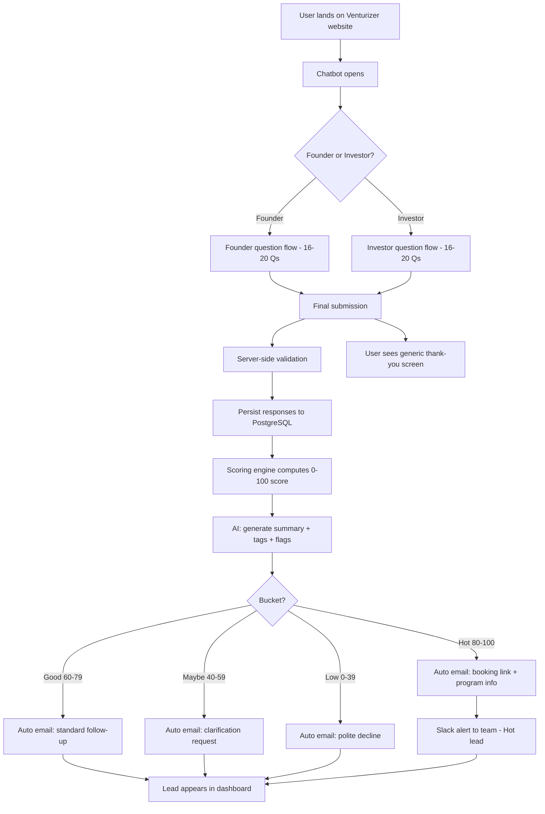
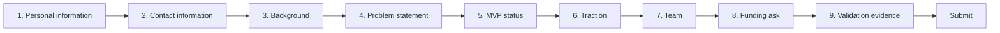
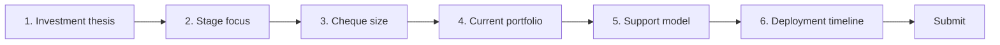
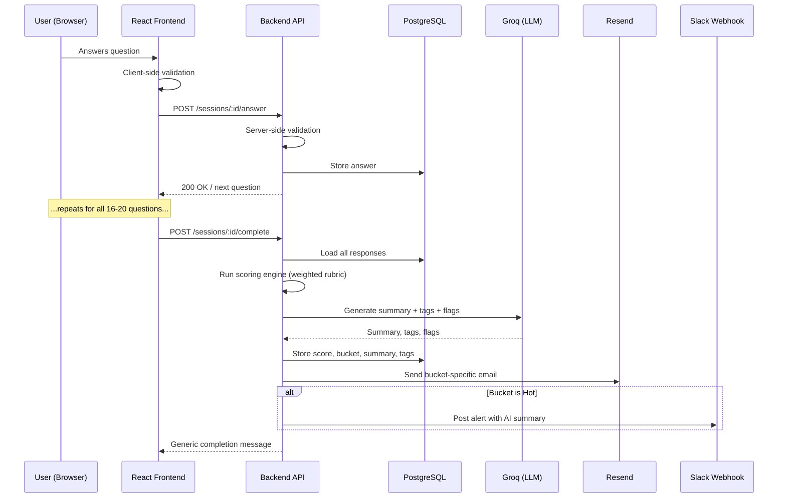
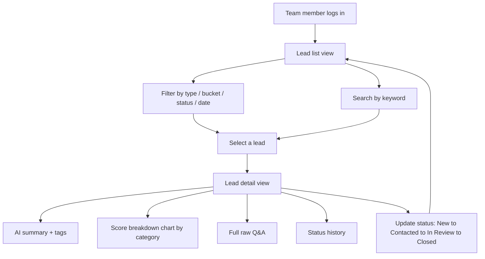
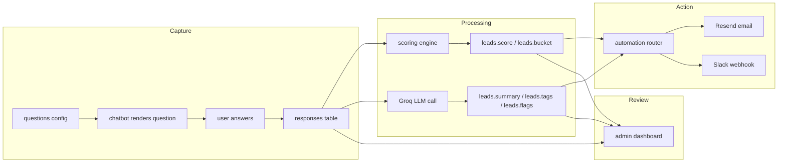

# Application Flow
## Venturizer — Lead Qualification Chatbot + ERP Dashboard

This document covers: the end-to-end user journey, the founder and investor question flows, the backend/automation pipeline, and the admin dashboard flow. Diagrams are written in Mermaid (renders natively on GitHub).

---

## 1. High-Level User Journey

## 2. Founder Flow (question sequence, by category)

Ordered easy → hard to build momentum early and reduce drop-off on the harder reflective questions later.

Notes on UX per step:
- Steps 1–2 (personal/contact info): quick text inputs, autofocus, minimal friction — builds early momentum.
- Steps 3–5 (background, problem, MVP status): mix of quick-select chips (e.g. MVP status: Idea / Prototype / Live) and short free text.
- Step 6 (traction): structured fields (users, revenue, growth rate) where applicable, free text fallback for pre-traction founders.
- Step 7 (team): repeatable sub-block per team member (name, role, background) — capped at a sensible max (e.g. 5) to avoid runaway length.
- Step 8 (funding ask): slider input bounded to a realistic range, not a blank number field.
- Step 9 (validation evidence): open free text — this is the most effortful question, placed last so the user is already invested in finishing.

## 3. Investor Flow (question sequence, by category)

Notes on UX per step:
- Step 2 (stage focus): quick-select chips (Pre-seed / Seed / Series A / etc.), multi-select allowed.
- Step 3 (cheque size): slider with a realistic min/max range.
- Step 4 (portfolio): short free text or a repeatable "company name" list.
- Step 5 (support model): quick-select chips (Capital only / Capital + mentorship / Capital + operational support / etc.).
- Step 6 (deployment timeline): quick-select (Immediate / 1–3 months / 3–6 months / Opportunistic).

## 4. Backend Processing Sequence (single submission)

## 5. Admin Dashboard Flow

## 6. Data Flow (what gets stored, when)

---

## Summary

The flow is intentionally linear and config-driven at the data-capture layer (questions are data, not hardcoded UI), branches once at the very start (founder vs investor), and fans out into automation immediately after scoring — so the team's dashboard never shows a "raw," unprocessed lead. Every lead that reaches a human has already been summarized, tagged, scored, and (for Hot/Good/Maybe/Low) had its first-touch communication handled automatically.
